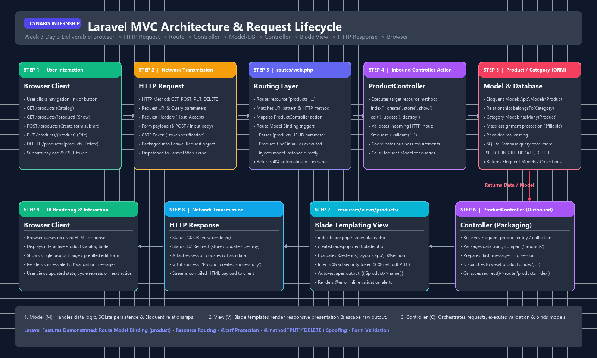

# Cynaris Web Development Internship — Week 3 Day 2: Laravel Basics

## Project Overview
This project contains the **Laravel Basics** implementation for Week 3 Day 2 of the Cynaris Internship. It demonstrates fundamental Laravel MVC architectural patterns, route handling, controller logic, Blade template inheritance, server-side form validation, and CSRF protection.

- **Framework Version:** Laravel Framework `13.32.0`
- **PHP Version:** PHP `8.5.10`
- **Composer Version:** Composer `2.10.3`
- **Environment:** Local Development (Windows / PHP CLI)

---

## Setup & Local Configuration

### 1. Prerequisites
Ensure PHP 8.2+ (tested on PHP 8.5.10) with the `fileinfo` extension enabled in `php.ini`, and Composer are installed.

### 2. Initial Setup Commands
```bash
# Navigate to the Laravel project directory
cd laravel_basics

# Install dependencies (if not already installed)
composer install

# Generate the application encryption key
php artisan key:generate

# Clear any cached configuration
php artisan config:clear
```

### 3. Environment Configuration (`.env`)
For lightweight local development without requiring external database services:
- `APP_ENV=local`
- `APP_DEBUG=true`
- `SESSION_DRIVER=file`
- `CACHE_STORE=file`

> **Note:** The `.env` file is excluded from version control via `.gitignore` to safeguard secrets and environment-specific settings.

### 4. Running the Application Locally
Start the built-in development server:
```bash
php artisan serve
```
The application will be accessible at:
```
http://127.0.0.1:8000
```

---

## Demonstration Routes List

The project defines **exactly 5 demonstration routes** in `routes/web.php` (3 GET routes and 2 POST routes):

| HTTP Method | URI Pattern | Route Name | Controller Action | Description |
| :--- | :--- | :--- | :--- | :--- |
| **GET** | `/` | `home` | `HomeController@index` | Main landing page displaying internship overview and dynamically passed feature cards. |
| **GET** | `/about/{topic?}` | `about` | `HomeController@about` | Parameterized route demonstrating optional parameter capture (`{topic?}`) with defaults and topic switching. |
| **GET** | `/form` | `form.index` | `FormController@index` | Interactive feedback and contact form page with department options. |
| **POST** | `/form` | `form.submit` | `FormController@submit` | Handles contact form submissions with server-side validation and `@csrf` token protection. |
| **POST** | `/subscribe` | `newsletter.subscribe` | `FormController@subscribe` | Handles quick newsletter subscription POST requests with email validation. |

Verify the registered routes anytime using Artisan:
```bash
php artisan route:list
```

---

## Controllers

All route logic is organized within two controllers located in `app/Http/Controllers/`:

### 1. `HomeController` (`app/Http/Controllers/HomeController.php`)
- `index(): View`
  - Prepares page metadata, introductory text, and feature lists.
  - Passes data to `resources/views/home.blade.php` using the `compact()` helper.
- `about(?string $topic = 'internship'): View`
  - Accepts an optional `$topic` route parameter (default: `'internship'`).
  - Resolves topic details from an associative map.
  - Passes formatted topic and descriptive content to `resources/views/about.blade.php` using `compact()`.

### 2. `FormController` (`app/Http/Controllers/FormController.php`)
- `index(): View`
  - Prepares the department selections list.
  - Passes available departments to `resources/views/form.blade.php` using `compact()`.
- `submit(Request $request): RedirectResponse`
  - Enforces server-side validation:
    - `name`: `required|string|min:2|max:50`
    - `email`: `required|email`
    - `department`: `required|string|in:internship,support,feedback,general`
    - `message`: `required|string|min:5|max:500`
  - Redirects back with input (`withInput()`) and flash session status (`with('success', ...)`).
- `subscribe(Request $request): RedirectResponse`
  - Validates `subscriber_email`: `required|email`.
  - Redirects back with flash message (`with('newsletter_success', ...)`).

---

## Blade Templating Concepts Demonstrated

The template layer is modularized under `resources/views/`:

```
resources/views/
├── layouts/
│   └── app.blade.php       # Master layout with HTML skeleton, header, footer, CSS
├── partials/
│   └── navbar.blade.php    # Reusable navigation bar partial
├── home.blade.php          # Home view extending master layout
├── about.blade.php         # Parameterized about view
└── form.blade.php          # POST forms with validation & feedback
```

### Key Directives Demonstrated:
1. **`@extends('layouts.app')`**: Inherits the common HTML shell, CSS styles, header, and footer in all child views.
2. **`@yield('title', '...')` & `@yield('content')`**: Defines content placeholders inside `layouts/app.blade.php` that child views populate.
3. **`@section('title', ...)` & `@section('content') ... @endsection`**: Injects page-specific titles and main body content into the parent layout.
4. **`@include('partials.navbar')`**: Embeds the reusable navigation bar component into the header.
5. **`@csrf`**: Injects a hidden CSRF token input (`<input type="hidden" name="_token" value="...">`) into HTML forms to prevent Cross-Site Request Forgery.
6. **`@if`, `@error`, `@foreach`**: Conditional rendering for alert messages, field-level error messages, and iterating over controller collections.

---

## How Controller Data is Passed Using `compact()`

In PHP and Laravel, `compact()` takes string variable names and bundles them into an associative array where the variable names become the keys and their values become the array values.

### Example in `HomeController`:
```php
public function index(): View
{
    $title = 'Laravel Basics - Week 3 Day 2';
    $subtitle = 'Welcome to the Cynaris Internship Week 3 Day 2 Laravel Demonstration.';
    $frameworkFeatures = [ ... ];

    // compact('title', 'subtitle', 'frameworkFeatures') produces:
    // ['title' => $title, 'subtitle' => $subtitle, 'frameworkFeatures' => $frameworkFeatures]
    return view('home', compact('title', 'subtitle', 'frameworkFeatures'));
}
```

### Rendering Inside the Blade View (`resources/views/home.blade.php`):
```blade
<h1>{{ $title }}</h1>
<p>{{ $subtitle }}</p>

@foreach ($frameworkFeatures as $feature)
    <div class="feature-card">
        <h3>{{ $feature['title'] }}</h3>
        <p>{{ $feature['description'] }}</p>
    </div>
@endforeach
```

---

## Security & Best Practices

1. **CSRF Protection:** All POST forms include `@csrf`. Unauthenticated or forged POST requests receive HTTP 419 (Page Expired).
2. **XSS Prevention:** All user-supplied data (such as echoed submitted payloads) is rendered using Blade's default `{{ $data }}` syntax, which automatically escapes output via PHP's `htmlspecialchars()`.
3. **Environment Security:** Secrets and app keys are stored exclusively in `.env`, which is ignored by Git.

---

---

# Week 3 Day 3: MVC Architecture & Product CRUD

## Day 3 Objective
The primary objective of Week 3 Day 3 is to build a complete, production-grade **Laravel Model-View-Controller (MVC) CRUD** implementation using a **Product** resource with a **Category** relationship. This demonstrates the end-to-end request lifecycle in Laravel, separation of concerns, Route Model Binding, database migrations, model relationships, data seeding, Blade template inheritance, server-side validation, and automated feature testing.

---

## Deliverable: MVC Request Lifecycle Diagram
The visual architecture deliverable is available at:
📁 **[`docs/mvc-request-lifecycle.png`](docs/mvc-request-lifecycle.png)**



### The 9-Stage Request Lifecycle Flow:
```
Browser
  ↓  (1. User Action: link click / form submission)
HTTP Request
  ↓  (2. Method: GET/POST/PUT/DELETE, URI, CSRF token, headers)
Route
  ↓  (3. routes/web.php matches URI, resolves Route Model Binding)
Controller
  ↓  (4. ProductController method executes, validates request payload)
Model / Database
  ↓  (5. Eloquent queries SQLite via PDO, resolves belongsTo/hasMany)
Controller
  ↓  (6. Packages Eloquent models/collections into compact() array)
Blade View
  ↓  (7. resources/views/products/ compiles HTML, escapes XSS variables)
HTTP Response
  ↓  (8. HTTP 200 OK / 302 Redirect with flash session cookies)
Browser
     (9. Renders DOM and displays feedback alerts to user)
```

---

## MVC Components Explained

1. **Model (`app/Models/`):**
   - Represents business data, validation casts, and database schema relationships.
   - Encapsulates database queries through Eloquent ORM without requiring raw SQL.
   - Manages mass-assignment safety via the `$fillable` property.

2. **View (`resources/views/`):**
   - The presentation layer written in Blade templating engine.
   - Inherits layout structure (`@extends('layouts.app')`), defines content blocks (`@section`), and displays data.
   - Automatically sanitizes and escapes raw data using `{{ $variable }}` (`htmlspecialchars()`).
   - Handles form security via `@csrf` and RESTful method spoofing via `@method('PUT')` / `@method('DELETE')`.

3. **Controller (`app/Http/Controllers/`):**
   - The central orchestrator that receives HTTP requests from the router.
   - Enforces validation rules on request payloads.
   - Interacts with Models to fetch, create, update, or delete data.
   - Selects the appropriate Blade view or issues an HTTP redirect with flash session messages.

---

## Models & Database Relationships

### 1. `Product` Model (`app/Models/Product.php`)
- **Table:** `products`
- **Mass-Assignment Fillable:**
  ```php
  protected $fillable = [
      'category_id',
      'name',
      'description',
      'price',
  ];
  ```
- **Type Casting:**
  ```php
  protected $casts = [
      'price' => 'decimal:2',
  ];
  ```
- **Relationship:**
  ```php
  public function category(): BelongsTo
  {
      return $this->belongsTo(Category::class);
  }
  ```

### 2. `Category` Model (`app/Models/Category.php`)
- **Table:** `categories`
- **Mass-Assignment Fillable:**
  ```php
  protected $fillable = [
      'name',
      'slug',
      'description',
  ];
  ```
- **Relationship:**
  ```php
  public function products(): HasMany
  {
      return $this->hasMany(Product::class);
  }
  ```

---

## Database Migrations & Seeding

### Migrations
1. **`database/migrations/2026_09_16_000001_create_categories_table.php`**:
   - `id`: Auto-incrementing primary key
   - `name`: string
   - `slug`: unique string
   - `description`: nullable text
   - `timestamps()`: `created_at` and `updated_at`

2. **`database/migrations/2026_09_16_000002_create_products_table.php`**:
   - `id`: Auto-incrementing primary key
   - `category_id`: foreignId constrained to `categories.id` with `nullOnDelete()`
   - `name`: string
   - `description`: nullable text
   - `price`: decimal(8, 2)
   - `timestamps()`: `created_at` and `updated_at`

### Seed Data
- **`CategorySeeder.php`**: Seeds 4 standard tech categories (`Development Tools`, `Cloud Infrastructure`, `Cybersecurity`, `Hardware & Peripherals`).
- **`ProductSeeder.php`**: Seeds 8 realistic tech products (e.g. PhpStorm IDE, Cloud Compute Node, SSL Certificate, Mechanical Split Keyboard) mapped to their corresponding categories.
- Run migrations and seed database:
  ```bash
  php artisan migrate:fresh --seed
  ```

---

## ProductController Methods

The controller `app/Http/Controllers/ProductController.php` implements all **7 standard RESTful resource methods**:

| Method | HTTP Verb | URI | Purpose | MVC Action |
| :--- | :--- | :--- | :--- | :--- |
| `index()` | `GET` | `/products` | Display paginated catalog | Fetches `Product::with('category')->latest()->paginate(8)` and renders `products.index`. |
| `create()` | `GET` | `/products/create` | Show creation form | Fetches `Category::all()` and renders `products.create`. |
| `store()` | `POST` | `/products` | Persist new product | Validates request input, calls `Product::create()`, and redirects with flash message. |
| `show()` | `GET` | `/products/{product}` | Display single product | Injects `Product $product` via Route Model Binding, loads category, and renders `products.show`. |
| `edit()` | `GET` | `/products/{product}/edit` | Show edit form | Injects `Product $product`, loads categories, and renders `products.edit`. |
| `update()` | `PUT/PATCH` | `/products/{product}` | Update existing record | Injects `Product $product`, validates input, calls `$product->update()`, and redirects with flash message. |
| `destroy()` | `DELETE` | `/products/{product}` | Remove record | Injects `Product $product`, calls `$product->delete()`, and redirects with flash message. |

### Validation Rules in `store()` and `update()`
```php
$request->validate([
    'name' => 'required|string|min:2|max:255',
    'category_id' => 'nullable|exists:categories,id',
    'price' => 'required|numeric|min:0|max:999999.99',
    'description' => 'nullable|string|max:2000',
]);
```

---

## Resource Routing & Route Model Binding

### Registered Resource Route
In `routes/web.php`:
```php
Route::resource('products', ProductController::class);
```

### Route Model Binding
Instead of manually looking up records using `Product::findOrFail($id)`:
```php
// Without Route Model Binding:
public function show($id) {
    $product = Product::findOrFail($id);
    return view('products.show', compact('product'));
}

// With Laravel Route Model Binding:
public function show(Product $product): View {
    $product->load('category');
    return view('products.show', compact('product'));
}
```
Laravel matches the `{product}` URI wildcard against the controller's type-hinted `Product $product` argument. If no record with matching primary key exists in SQLite, Laravel automatically throws an `ItemNotFoundException` resulting in an HTTP 404 response.

---

## Blade Views

All views are located in `resources/views/products/` and inherit `layouts/app.blade.php`:

1. **`resources/views/products/index.blade.php`**:
   - Product table with IDs, names, category badges, prices, and created dates.
   - Action buttons: `View`, `Edit`, and `Delete` (form with `@csrf` and `@method('DELETE')`).
   - Session flash alerts for feedback (`session('success')`).
   - Pagination links (`{{ $products->links() }}`).
   - Educational panel explaining the MVC request lifecycle.

2. **`resources/views/products/show.blade.php`**:
   - Single product detail card with formatted price, category relationship box, and timestamps.
   - Actions: `Back to Catalog`, `Edit Product`, `Delete Product`.
   - Route Model Binding educational callout.

3. **`resources/views/products/create.blade.php`**:
   - Create form with `@csrf` token directive.
   - Dynamic category selection dropdown.
   - Validation error summary banner (`$errors->any()`) and inline input feedback (`@error('fieldName')`).
   - Form state persistence using `old('fieldName')`.

4. **`resources/views/products/edit.blade.php`**:
   - Edit form using method spoofing: `@method('PUT')`.
   - Pre-populated input values with fallback: `old('name', $product->name)`.
   - Category relationship selection.

---

## Automated Verification & Test Results

Run all feature and unit tests:
```bash
php artisan test
```

### Test Suite Execution Output:
```text
Product Crud (Tests\Feature\ProductCrud)
 ✔ Products index displays product catalog
 ✔ Product create page renders successfully
 ✔ Product can be stored with valid data
 ✔ Product store validation fails with invalid data
 ✔ Product show displays product using route model binding
 ✔ Product show returns 404 for missing record
 ✔ Product edit page renders with existing values
 ✔ Product can be updated using route model binding
 ✔ Product update fails validation with invalid price
 ✔ Product can be deleted using route model binding

Demonstration Routes (Tests\Feature\DemonstrationRoutes)
 ✔ Home route renders successfully
 ✔ About default topic
 ✔ About with route parameter
 ✔ Form index renders successfully
 ✔ Form submit with valid data
 ✔ Form submit validation failure
 ✔ Newsletter subscribe success
 ✔ Newsletter subscribe validation failure

Example (Tests\Feature\Example)
 ✔ The application returns a successful response

Tests:    20 passed (73 assertions)
Duration: 1.03s
```

---

## Browser Verification

Manual and automated browser verification via the browser subagent confirmed:
1. `/products` displays the catalog, formatted prices, and category badges.
2. Clicking a product name or `View` displays the show page via Route Model Binding.
3. Submitting invalid data on `/products/create` displays server-side validation error banners.
4. Submitting valid data creates a new product and redirects to index with a success flash alert.
5. Clicking `Edit` pre-fills the form with existing model attributes.
6. Updating the product persists changes to SQLite and redirects with success alert.
7. Deleting the product removes it cleanly from the database and updates the table.
8. Browser console log inspection: **0 console errors detected**.
