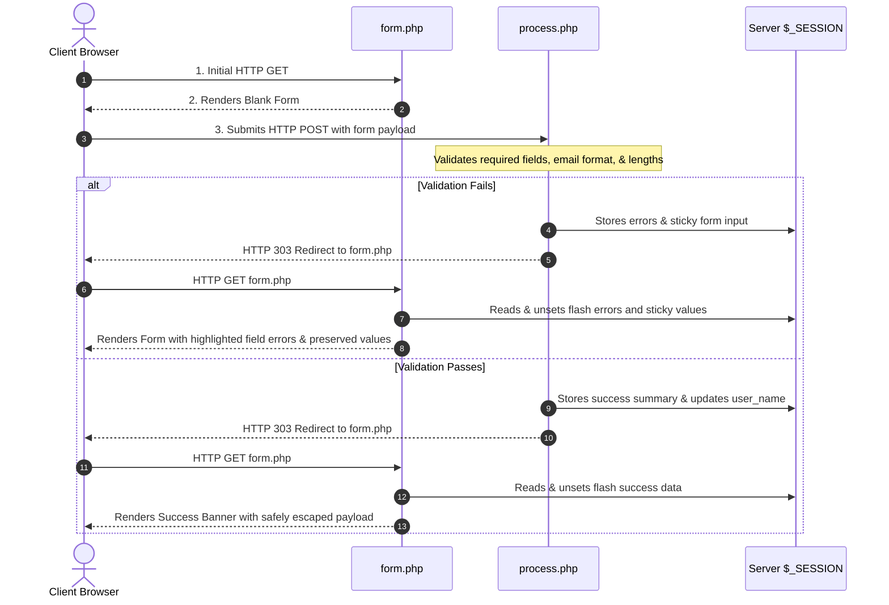

# 🚀 Week 3 – Day 1: PHP Fundamentals & Server-Side Architecture

Welcome to the **Week 3 Day 1 Practical Deliverable** of the **Cynaris Solutions Full Stack Development Internship**.

This project provides an interactive demonstration of modern **PHP 8.5** fundamentals, server-side form processing via the **Post/Redirect/Get (PRG)** pattern, superglobals (`$_GET`, `$_POST`, `$_SESSION`), and defensive web application security practices (validation vs. sanitization vs. context-aware output escaping for XSS prevention).

---

## 📑 Table of Contents

1. [Project Overview](#-project-overview)
2. [What Was Learned](#-what-was-learned)
3. [PHP Concepts Demonstrated](#-php-concepts-demonstrated)
4. [Form Handling Architecture (PRG Pattern)](#-form-handling-architecture-prg-pattern)
5. [Deep Dive into Superglobals](#-deep-dive-into-superglobals)
6. [Security Architecture & XSS Defense](#-security-architecture--xss-defense)
7. [Directory & File Structure](#-directory--file-structure)
8. [Local Setup & Execution Guide](#-local-setup--execution-guide)
9. [Automated & Manual Verification Test Matrix](#-automated--manual-verification-test-matrix)
10. [Example Test URLs & Payloads](#-example-test-urls--payloads)
11. [Viva & Technical Interview Preparation](#-viva--technical-interview-preparation)

---

## 🎯 Project Overview

In enterprise web architectures, PHP functions as a fast, dynamically typed, server-side execution engine powering web services, content management platforms, and REST APIs. 

This deliverable demonstrates foundational server-side development concepts cleanly partitioned into independent files:
- **`index.php`**: Interactive language explorer (variables, data types, arrays, conditionals, loops, functions).
- **`form.php`**: Accessible contact and feedback form featuring sticky inputs, validation error alerts, and XSS test presets.
- **`process.php`**: Headless server-side POST handler strictly applying the Post/Redirect/Get (PRG) pattern.
- **`get_example.php`**: URL query string explorer inspecting parameters, providing defaults, and demonstrating entity escaping.
- **`session_example.php`**: Server-side session state manager showcasing visit tracking, runtime session modification, and secure session destruction.
- **`functions.php`**: Centralized security, validation, escaping, and layout utility library.
- **`style.css`**: Modern responsive design system with dark glassmorphism, responsive grid layouts, and custom properties.

---

## 🧠 What Was Learned

During this practical implementation, key core competencies mastered include:
1. **PHP 8.5 Primitives & Strict Typing**: Leveraging `declare(strict_types=1);`, scalar type hints, union types, and return types.
2. **Server-Side Validation**: Defensive input validation using `filter_var(..., FILTER_VALIDATE_EMAIL)` and regex pattern checks prior to state storage.
3. **PRG (Post/Redirect/Get) Workflow**: Preventing duplicate HTTP POST submissions upon browser reload through HTTP 302/303 redirects.
4. **Superglobal Scope & Lifecycle**: Understanding differences in lifetime and transport between request-scoped (`$_GET`, `$_POST`) and persistent (`$_SESSION`) superglobals.
5. **Session Security Mechanics**: Protecting session cookies with `HttpOnly`, `SameSite=Lax`, and mitigating session fixation with `session_regenerate_id()`.
6. **Defense-in-Depth against XSS**: Proper placement of `htmlspecialchars($val, ENT_QUOTES | ENT_SUBSTITUTE, 'UTF-8')` to neutralize Cross-Site Scripting vulnerabilities.

---

## 🧩 PHP Concepts Demonstrated

### 1. Variables & Common Data Types
- **String**: `$companyName = "Cynaris Solutions";`
- **Integer**: `$internshipWeek = 3;`
- **Float**: `$dailyCompletionScore = 98.75;`
- **Boolean**: `$isEnrollmentActive = true;`
- **Null**: `$mentorAssigned = null;`
- **Array**: `$coreCompetencies = ["PHP 8.5", "HTTP", "REST"];`
- Evaluated via `gettype()` and formatted into responsive tabular views.

### 2. Arrays (Indexed vs. Associative)
- **Indexed Arrays**: Sequentially ordered numeric keys (`$curriculumModules[0]`).
- **Associative Arrays**: Descriptive string key-value mappings (`$internProfile['role']`).
- Array helper utilities: `count()`, `implode()`, `array_keys()`, `in_array()`.

### 3. Control Structures & Conditionals
- **Standard Branching**: `if / elseif / else` scoring evaluation.
- **Modern PHP 8 `match` Expression**: Strict identity matching on `PHP_SAPI` providing clean, expression-based returns without fall-through errors.

### 4. Loops & Iteration
- **`for`**: Fixed-iteration milestone progress generation.
- **`while`**: Condition-tested retry attempts and network probe logging.
- **`do...while`**: Guaranteed single-pass heartbeat verification.
- **`foreach`**: Key-value traversal of indexed lists and associative metadata dictionaries.

### 5. Functions & Type Declarations
- Explicit argument typing (`string $candidateName`, `float $score`, default `string $suffix = "P.E."`).
- Strict return type enforcement (`: string`).

---

## 🔄 Form Handling Architecture (PRG Pattern)

Handling form submissions directly within the display script can lead to confusing duplicate submissions if the user refreshes their browser window. This deliverable separates responsibilities into **`form.php`** (presentation) and **`process.php`** (processing):



### Sticky Form Implementation
When validation fails, user inputs are stored in `$_SESSION['form_data']` and re-injected into form input attributes:
```php
<input 
    type="text" 
    name="name" 
    value="<?= escapeHtml($formData['name'] ?? '') ?>" 
    class="form-control <?= isset($errors['name']) ? 'is-invalid' : '' ?>"
>
```
This guarantees user convenience while neutralizing stored or reflected script injection through `escapeHtml()`.

---

## 🌐 Deep Dive into Superglobals

Superglobals are built-in PHP associative arrays accessible from any scope without requiring `global $variable;`.

| Superglobal | Transport / Origin | Primary Purpose | Security Considerations |
|---|---|---|---|
| `$_GET` | URL Query String (`?key=val`) | Reading idempotent query filters, search queries, pagination offsets, and view modes. | Never transmit passwords or sensitive tokens. Visible in browser history and server logs. |
| `$_POST` | HTTP Request Body (`application/x-www-form-urlencoded` or `multipart/form-data`) | Submitting data mutations, form submissions, and authentication payloads. | Must enforce CSRF protection, strict server-side validation, and rate limiting. |
| `$_SESSION` | Server Memory / Filesystem (referenced via client `PHPSESSID` cookie) | Persisting user state across stateless requests (authentication identity, shopping carts, flash messages). | Set `HttpOnly`, `SameSite=Lax`, rotate session ID via `session_regenerate_id()`, and clear on logout. |

---

## 🛡️ Security Architecture & XSS Defense

### 1. Validation vs. Sanitization vs. Output Escaping

> [!IMPORTANT]
> A common beginner mistake is treating sanitization or `htmlspecialchars()` as an all-in-one security shield. Each layer plays a distinct role:

- **Validation (Input Gatekeeper)**:
  - Verifies whether incoming data matches expected types, allowed options, formats, and length bounds.
  - *Example*: `filter_var($email, FILTER_VALIDATE_EMAIL)` rejects invalid email strings before they enter the system.
- **Sanitization (Input Normalizer)**:
  - Normalizes data by removing unwanted whitespace (`trim($input)`).
  - Sanitization cleans inputs but does NOT make them safe for HTML rendering.
- **Output Escaping (Context-Specific Defense)**:
  - Converts active HTML control characters into neutral entities:
    - `<` &rarr; `&lt;`
    - `>` &rarr; `&gt;`
    - `"` &rarr; `&quot;`
    - `'` &rarr; `&#039;`
    - `&` &rarr; `&amp;`
  - Applied via `htmlspecialchars($value, ENT_QUOTES | ENT_SUBSTITUTE, 'UTF-8')` immediately before outputting into an HTML template.

> [!WARNING]
> **Context Matters:**
> - `htmlspecialchars()` protects against **HTML-body Cross-Site Scripting (XSS)**.
> - It does **NOT** protect against **SQL Injection** (which requires PDO prepared statements with parameterized queries).
> - It does **NOT** protect against **Command Injection** (which requires avoiding shell execution or using `escapeshellarg()`).
> - It does **NOT** sanitize JavaScript execution contexts inside `<script>` blocks or `onclick` handlers (which require JSON encoding or strict attribute sanitization).

---

## 📁 Directory & File Structure

```
php_basics/
├── functions.php       # Centralized helper library: validation, sanitization, escaping, and layout
├── style.css           # Modern, mobile-first responsive stylesheet & glassmorphism theme
├── index.php           # PHP Fundamentals dashboard (variables, arrays, conditionals, loops, functions)
├── form.php            # Interactive form UI with sticky inputs, validation error alerts, & XSS demo
├── process.php         # Server-side POST processor implementing PRG pattern & session flashing
├── get_example.php     # URL query string explorer ($_GET), parameter fallbacks, & live query sandbox
├── session_example.php # Session state manager ($_SESSION), visit counter, active table, & reset action
└── README.md           # Comprehensive technical documentation & testing instructions
```

---

## 💻 Local Setup & Execution Guide

### Prerequisites
- PHP 8.1+ (Demonstration engineered & verified on **PHP 8.5.10 CLI**).
- Modern web browser (Chrome, Edge, Firefox, Safari).

### Starting the Built-In PHP Development Server

Open a terminal or PowerShell prompt in the `Cynaris-Internship` root repository directory and execute:

```powershell
php -S localhost:8000 -t php_basics
```

Alternatively, change directory directly into `php_basics/` and run:

```powershell
cd php_basics
php -S localhost:8000
```

The terminal will report:
```
[Mon Sep 14 21:05:53 2026] PHP 8.5.10 Development Server (http://localhost:8000) started
```

Visit the application in your browser at:
👉 **[http://localhost:8000](http://localhost:8000)**

---

## 🧪 Automated & Manual Verification Test Matrix

### 1. PHP Syntax Linter Verification
Run syntax validation against every PHP source file:

```powershell
php -l php_basics/functions.php
php -l php_basics/index.php
php -l php_basics/form.php
php -l php_basics/process.php
php -l php_basics/get_example.php
php -l php_basics/session_example.php
```
**Expected Result:** `No syntax errors detected in [filename]` for all 6 files.

### 2. Comprehensive Test Checklist

| # | Test Scenario | Steps to Execute | Expected Outcome | Status |
|---|---|---|---|---|
| **T-01** | Landing Page Load | Navigate to `http://localhost:8000/` | All 5 fundamentals sections render with live evaluated values. | ✅ PASS |
| **T-02** | Default GET Params | Navigate to `http://localhost:8000/get_example.php` | Fallbacks activate (`Guest Developer`, `PHP 8.5 Superglobals`). | ✅ PASS |
| **T-03** | Custom GET Params | Navigate to `get_example.php?name=Sachin&topic=PHP` | Query parameters extracted and rendered safely in table. | ✅ PASS |
| **T-04** | GET XSS Mitigation | Navigate to `get_example.php?name=<script>alert('XSS')</script>` | Script tag displayed as text `&lt;script&gt;`, no popup fires. | ✅ PASS |
| **T-05** | Empty Form Validation | Navigate to `form.php` and click "Submit Form" | Errors displayed for Name, Email, Topic, and Message. | ✅ PASS |
| **T-06** | Invalid Email Rejection | Submit form with email `notanemail` | Field flagged invalid, remaining inputs retained safely. | ✅ PASS |
| **T-07** | Valid Form Submission | Fill valid data and submit | 303 Redirect to `form.php`, green success banner displays details. | ✅ PASS |
| **T-08** | Sticky Input Retention | Submit form with 1 invalid field | Valid fields remain populated in inputs; no data retyping required. | ✅ PASS |
| **T-09** | Form XSS Mitigation | Click "Fill XSS Payload" & submit | Script tag escaped in success table; no alert box executes. | ✅ PASS |
| **T-10** | Session Visit Counter | Visit `session_example.php` and refresh | Counter increments (+1 per reload); creation timestamp preserved. | ✅ PASS |
| **T-11** | Cross-Page State Sync | Submit name on `form.php`, check `session_example.php` | `$_SESSION['user_name']` reflects the submitted name. | ✅ PASS |
| **T-12** | Session ID Regeneration | Click "Regenerate Session ID" button | Session ID updates; existing session data remains intact. | ✅ PASS |
| **T-13** | Session Reset / Wipe | Click "Reset / Clear Session" button | Session wiped, visit counter resets to 1, alert confirms reset. | ✅ PASS |
| **T-14** | Mobile Responsiveness | Inspect in DevTools at 320px, 768px, 1024px | Zero horizontal scroll, cards stack cleanly, touch targets accessible. | ✅ PASS |

---

## 🔗 Example Test URLs & Payloads

Quick links to test the server directly:
- **Default Explorer**: `http://localhost:8000/`
- **Form Interface**: `http://localhost:8000/form.php`
- **GET Default View**: `http://localhost:8000/get_example.php`
- **GET Profile Query**: `http://localhost:8000/get_example.php?name=Sachidananda+Nayak&topic=Full+Stack+Internship&role=Software+Engineer`
- **GET XSS Test**: `http://localhost:8000/get_example.php?name=%3Cscript%3Ealert(%27XSS-Test%27)%3C%2Fscript%3E&topic=Defensive+Encoding`
- **Session State**: `http://localhost:8000/session_example.php`
- **Session Reset**: `http://localhost:8000/session_example.php?action=reset`

---

## 🎓 Viva & Technical Interview Preparation

### 1. What is the Post/Redirect/Get (PRG) pattern and why is it essential?
**Answer:** The PRG pattern is a web development design pattern where a web page does not render an HTML response directly after processing a POST request. Instead, it issues an HTTP 302 or 303 redirect to a GET endpoint. This prevents the "Confirm Form Resubmission" dialog on page refresh and prevents duplicate transactions (e.g. charging a credit card twice or creating duplicate database records).

### 2. What is the difference between `$_GET`, `$_POST`, and `$_REQUEST`?
**Answer:**
- `$_GET` contains parameters passed via the URL query string. It is visible, cached, and bookmarkable.
- `$_POST` contains data transmitted in the HTTP request body. It is hidden from URL history and suitable for payload transmission or mutations.
- `$_REQUEST` is an amalgam containing `$_GET`, `$_POST`, and `$_COOKIE`. Relying on `$_REQUEST` is generally discouraged as it obscures data origin, increases ambiguity, and can expose the application to unintended parameter injection.

### 3. How does PHP manage sessions internally?
**Answer:** When `session_start()` is called, PHP checks for a session cookie (typically `PHPSESSID`) in the incoming HTTP request. If not found, PHP generates a cryptographically random session identifier and returns it in a `Set-Cookie` header. On the server filesystem (or configured cache like Redis), PHP creates or retrieves a serialized session file (`sess_<session_id>`). Data stored in `$_SESSION` is read from and written to this server-side file, keeping the underlying data safe from client-side tampering.

### 4. Why does `htmlspecialchars()` protect against XSS, and when is it NOT enough?
**Answer:** `htmlspecialchars()` converts syntax-bearing HTML characters (`<`, `>`, `"`, `'`, `&`) into inert HTML entities (`&lt;`, `&gt;`, etc.). When the browser renders entities inside the HTML document body, it treats them strictly as visual glyphs rather than executable script markup.
However, it is insufficient if user data is injected into:
- JavaScript execution contexts (inside `<script>` tags or inline `onclick` attributes).
- URL schemes (e.g. `href="javascript:..."`).
- CSS style attributes (e.g. `style="expression(...)"`).
- SQL queries (which require PDO parameterized statements).
- Shell execution (which requires `escapeshellarg()`).

---

## 👨‍💻 Author & Maintainer
- **Intern:** Sachidananda Nayak
- **Organization:** Cynaris Solutions
- **Track:** Full Stack Development Internship (Cloud & AI)
- **Module:** Week 3 Day 1 — PHP Fundamentals
